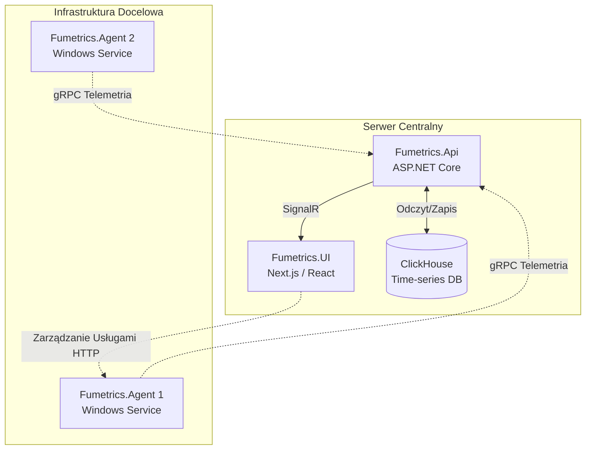
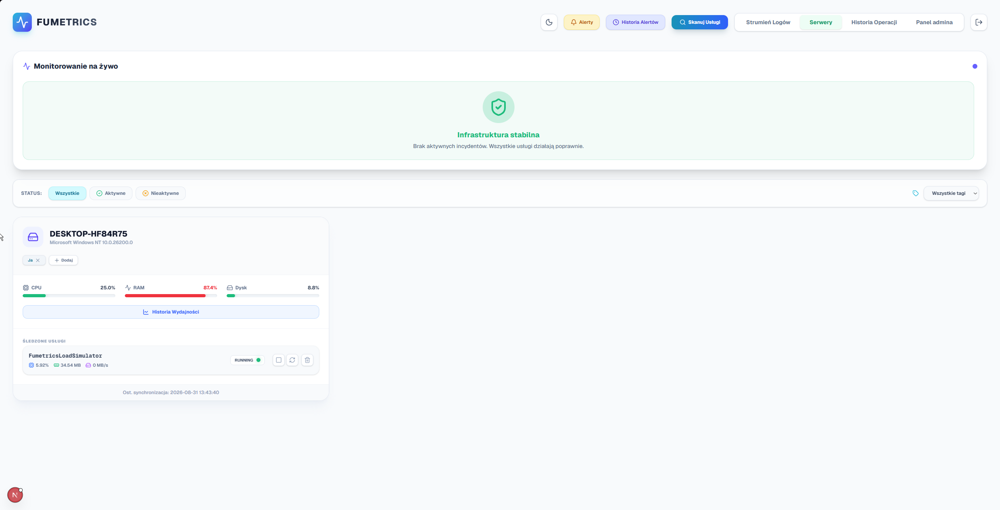
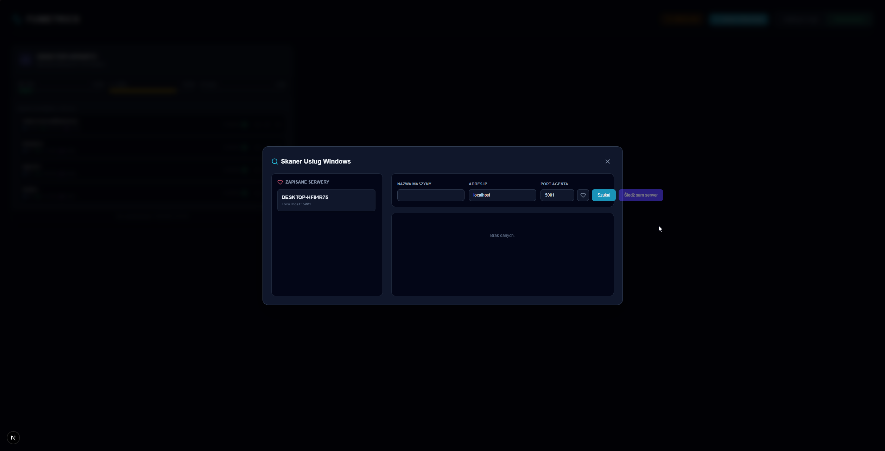
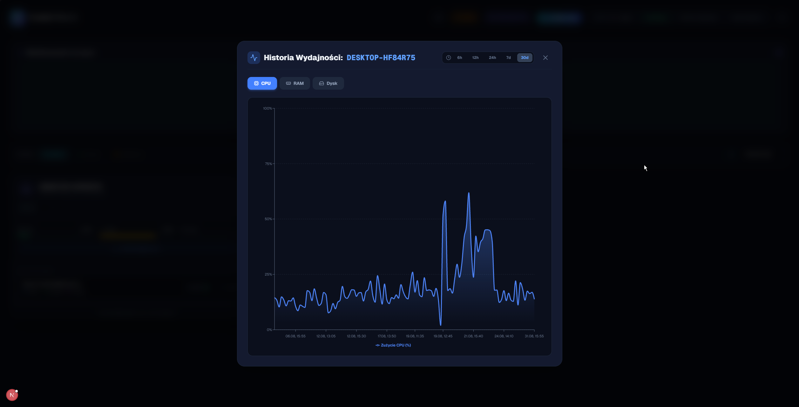
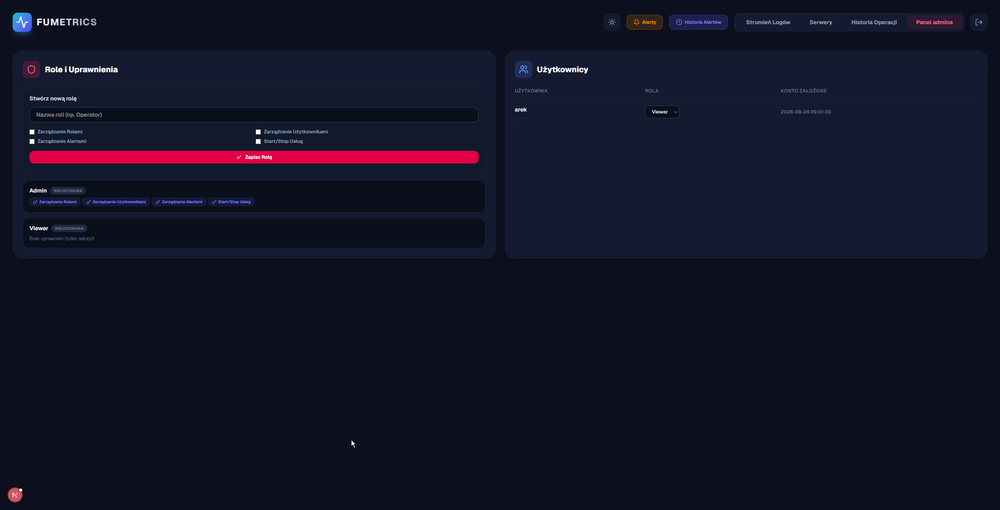

<div align="center">
  
  <h1>Fumetrics</h1>
  <p><strong>Nowoczesny i rozproszony system monitorowania infrastruktury Windows.</strong></p>
  <p>
    <a href="#-funkcje">Funkcje</a> •
    <a href="#%EF%B8%8F-architektura">Architektura</a> •
    <a href="#-technologie">Technologie</a> •
    <a href="#-szybki-start">Szybki start</a>
  </p>
</div>

---

## 🚀 Przegląd

**Fumetrics** to kompleksowe narzędzie typu open-source do monitorowania wydajności serwerów Windows oraz działających na nich usług w czasie rzeczywistym. Dzięki wykorzystaniu szybkiej bazy danych ClickHouse i strumieniowania danych z użyciem gRPC / SignalR, Fumetrics oferuje natychmiastowy wgląd w kondycję Twojej infrastruktury bez obciążania jej zasobów.

## ✨ Funkcje

- **📊 Monitorowanie w Czasie Rzeczywistym:** Śledź zużycie CPU, RAM i dysku zarówno na poziomie całego serwera, jak i pojedynczych procesów/usług Windows.
- **🛠️ Zarządzanie Usługami (Zdalne):** Uruchamiaj, zatrzymuj i restartuj usługi Windows prosto z przeglądarki dzięki zainstalowanemu Agentowi Fumetrics.
- **🚨 Alerty i Powiadomienia:** Konfiguruj zaawansowane reguły alarmowe z powiadomieniami e-mail po przekroczeniu ustalonych limitów zasobów.
- **🔐 System Ról i Uprawnień (RBAC):** Pełna kontrola nad dostępem. Twórz dedykowane role (np. Operator, Podglądacz) i przypisuj granularne uprawnienia do podglądu lub modyfikacji konfiguracji.
- **📈 Bogata Historia:** Analizuj długoterminowe metryki za pomocą interaktywnych wykresów w oparciu o bazę analityczną ClickHouse.
- **🕵️ Pełen Audyt (Audit Trail):** Śledź wszystkie operacje administracyjne (kto, z jakiego IP i kiedy uruchomił/zatrzymał usługę).
- **🌗 Nowoczesny Interfejs (Dark Mode):** Responsywny, przejrzysty i nowoczesny panel oparty o Next.js i Tailwind CSS.

## 🏗️ Architektura

Fumetrics składa się z trzech głównych komponentów, które ze sobą współpracują:



1. **Fumetrics.Agent:** Lekki agent działający na docelowych serwerach Windows (wymaga uprawnień Administratora). Zbiera telemetrię i wysyła ją strumieniem gRPC do głównego API. Posiada również prosty endpoint HTTP do nasłuchiwania na komendy włączenia/wyłączenia usług.
2. **Fumetrics.Api:** Główne serce systemu. Przyjmuje metryki od agentów, weryfikuje alerty, rozsyła maile z ostrzeżeniami i zapisuje wszystko do bazy ClickHouse. Wystawia również Hub SignalR oraz endpointy REST do zasilania interfejsu przeglądarkowego.
3. **Fumetrics.UI:** Nowoczesny frontend zbudowany w Next.js. Serwuje panele sterowania, dynamiczne wykresy Recharts i interakcje użytkownika.

## 💻 Technologie

| Komponent                 | Technologie                                                         |
| :------------------------ | :------------------------------------------------------------------ |
| **Baza Danych**           | ClickHouse                                                          |
| **Backend (API + Agent)** | C#, .NET 8, ASP.NET Core, gRPC, SignalR, BCrypt                     |
| **Frontend (UI)**         | React 18, Next.js, TypeScript, Tailwind CSS, Recharts, Lucide Icons |

## 🚀 Szybki start

### Wymagania

- **.NET 8 SDK**
- **Node.js** (v18+)
- **ClickHouse** (np. uruchomiony za pomocą Dockera)
  ```bash
  docker run -d --name clickhouse-server --ulimit nofile=262144:262144 -p 8123:8123 clickhouse/clickhouse-server
  ```

### 1. Uruchomienie API (Backend)

Baza danych (tabele, schemat) zostanie zainicjowana automatycznie podczas pierwszego uruchomienia API.

```bash
cd src/backend/Fumetrics.Api
dotnet run
```

_API będzie nasłuchiwać na porcie HTTP 5170 oraz udostępni usługi gRPC pod portem 50051._

### 2. Uruchomienie Agenta (Windows)

Należy uruchomić agenta na docelowej maszynie Windows z prawami Administratora, aby mógł on manipulować usługami systemowymi.

```bash
cd src/backend/Fumetrics.Agent
dotnet run
```

### 3. Uruchomienie Frontend (UI)

Zainstaluj zależności NPM i uruchom serwer deweloperski Next.js.

```bash
cd src/frontend
npm install
npm run dev
```

Otwórz w przeglądarce adres `http://localhost:3000`.
Domyślne dane logowania to:

- **Login:** `admin`
- **Hasło:** `admin123`

---

## 📸 Zrzuty ekranu

### Główny Panel

*Widok główny przedstawiający wszystkie podłączone serwery, ich zasoby oraz aktywne alerty.*

### Tryb Ciemny

*Aplikacja w pełni wspiera nowoczesny, przyjazny dla oczu tryb ciemny.*

### Historia Wydajności

*Interaktywne wykresy prezentujące zużycie procesora i pamięci RAM z ostatnich 30 dni.*

### Panel Administratora

*Zarządzanie użytkownikami, rolami oraz szczegółowymi uprawnieniami w systemie.*

---
